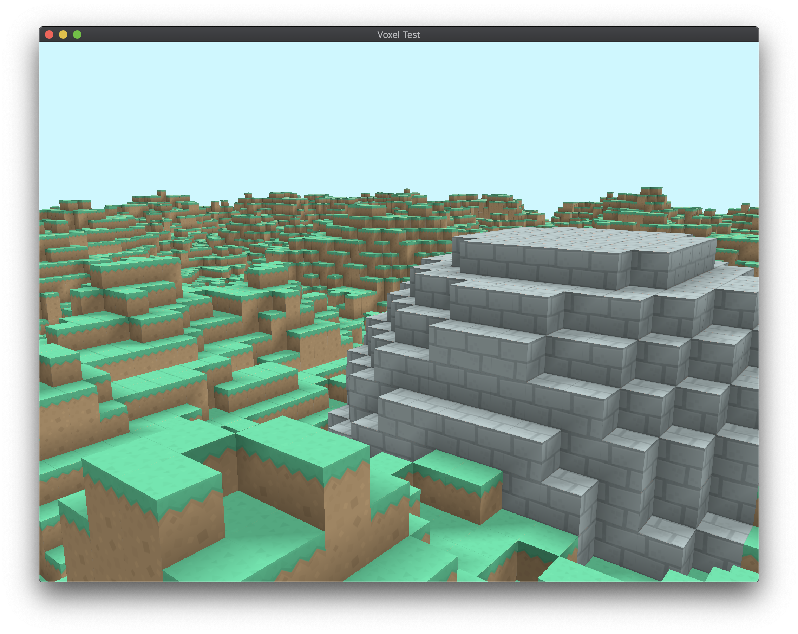

# Voxel Test

## Discussion

This is a small project used as a way to get familiar with [Glium](https://github.com/glium/glium).

Note that the performance is dismal, primarily since the terrain and mesh generation all operates on a single thread. It was initially designed this way in order to be compatible with WebAssembly.

Feel free to fork this project and make changes of your own!

## Running

* Make sure Rust is installed
* Execute `cargo run --release`
* Enjoy!

## Controls
* W, A, S, D – move forward, backward, left, and right
* Q, E – move down and up
* Shift – sprint
* Escape – unlock cursor
* Grave accent (`) – toggle debug mode
